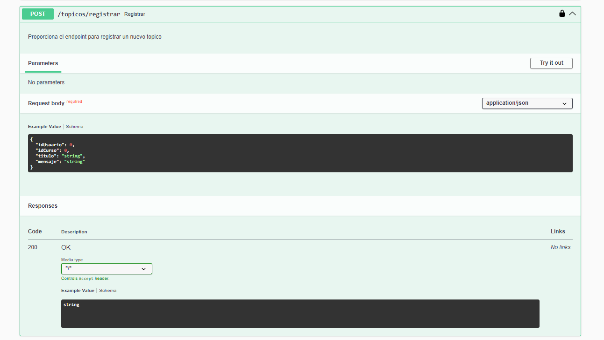

# CHALLENGE API FORO HUB

La API Foro Hub es un proyecto backend desarrollado en Java con  Spring Boot, concebido para aplicar los 
conocimientos adquiridos en Aluara Latam bajo el patrocinio de Oracle One Next Education. Esta API sigue
el modelo REST y funciona como un foro donde los usuarios pueden plantear preguntas sobre diversos temas
educativos relacionados con la programación. En  el   proyecto, se   especializo en el ámbito educativo, 
permitiendo a los estudiantes crear temas y resolver sus dudas.  Como  desarrollador backend en Java, he 
implementado operaciones  CRUD (Crear, Leer, Actualizar, Eliminar)  para  gestionar topicós,  respuestas, 
usuarios y cursos. Además, se ha integrado medidas de seguridad como la autenticación de usuarios para el
acceso y la  encriptación  de  datos  sensibles, como  contraseñas  almacenadas  en  la  base  de  datos.
En la configuración de  seguridad (securityConfigurations), se ha definido permisos para roles como USER,
ADMIN e INSTRUCTOR  para   distintos endpoints, todo usuario que se registra   su   role  por defecto es
"ROLE_USER" por seguridad para cambiar el role debe hacer el admin mediante el endpoint de actualización
de role de usuario, ese usuario primario fue insertado directamente en la base de datos. Por ejemplo, un
estudiante puede crear un topicó pero no una respuesta; esto está  reservado   para   administradores  o
instructores. También hemos implementado lógica en el servicio de usuario  para  asegurar que solo    el
usuario propio,        ADMIN    o  INSTRUCTOR autorizado puedan eliminarlo.  Para  la   autenticación  y
validación  de  usuarios, utilizamos JSON Web Token (JWT), garantizando   que   cada   acción  realizada
en  la  API  sea por un usuario autenticado con los permisos adecuados. Por ejemplo, un estudiante puede
tener  permisos  para  crear un topico pero no para eliminarlo de la base de   datos.   Además,    hemos  
utilizado  SpringDoc  para  la  documentación en formato JSON y para   generar  la  interfaz de  usuario
de Swagger,  la cual  ha  sido  personalizada  para  adaptarse a nuestras 
necesidades específicas.

*****************************************************************

## CONFIGURACIÓN DEL ENTORNO DE TRABAJO

### Tecnologías Utilizadas:

1. Lenguaje de programación: Java versión 17
2. Gestor de dependencias:   Maven versión 4
3. Framework: Spring Boot    versión 3.3.0
4. Dependencias utilizadas:
     
    Observación las  descripciones de las dependencias fueron hechas por IA.

    Lombok: Es una biblioteca de Java que ayuda a reducir el código boilerplate, como getters, setters, constructores, etc.
    Permite generar automáticamente este código a través de anotaciones, lo que hace que el código sea más conciso y legible.

    Spring Web: Esta dependencia proporciona las herramientas necesarias para construir aplicaciones web con Spring MVC.
    Incluye funcionalidades como controladores, vistas, interceptores y otros componentes web.

    Spring Boot DevTools:Esta dependencia proporciona herramientas de desarrollo que mejoran la experiencia de
    desarrollo con Spring Boot. Incluye características como recarga automática de la aplicación, soporte para LiveReload, etc.

    Spring Data JPA:Esta dependencia facilita la implementación de repositorios basados en JPA (Java Persistence API).
    Proporciona una capa de abstracción sobre JPA, lo que simplifica la interacción con la base de datos.

    Flyway Migration:Es una herramienta de migración de bases de datos que permite gestionar los cambios en el esquema de
    la base de datos de manera controlada. Ayuda a mantener la base de datos sincronizada entre diferentes entornos
    (desarrollo, producción, etc.).

    MySQL Driver:Esta dependencia proporciona el driver JDBC (Java Database Connectivity) necesario para conectar la 
    aplicación Spring Boot a una base de datos MySQL.
      
    Validation: Esta dependencia proporciona un conjunto de anotaciones y validadores para validar los datos de 
    entrada en la aplicación. Permite definir reglas de validación a nivel de modelo y aplicarlas de manera declarativa.

    Spring Security: Es un framework que proporciona seguridad a las aplicaciones web Java/Java EE.
    Permite implementar mecanismos de autenticación, autorización, protección contra ataques y otras características de seguridad.

******************************************************

### Estado  del proyecto:
    El proyecto cumple con lo planteado por Alura para el challenge Foro Hub, ademas tiene las tablas para 
    usuario, perfil, repuesta, curso y medidas de seguridad de los procesos de los endpoint.

***************************************************

### Licencia: Apache  0.2

**************************************************

## Documentación  creada con SpringDoc para la API Foro HUb:

### Documentación de json de la api

### Interfaz Swagger de la API

### Autenticaión de usuario para iniciar sesión

### Token generado para autorización y validación para realizar procesos

### Topico CRUD cread, read, update y delete

### Cread Registrar topico nuevo

### Read  Listar topicos

### Update Actualizar topico por id

### Delete Eliminar topicos por id

### Repuesta  endpoints

### Curso endpoints

### Usuario endpoints

